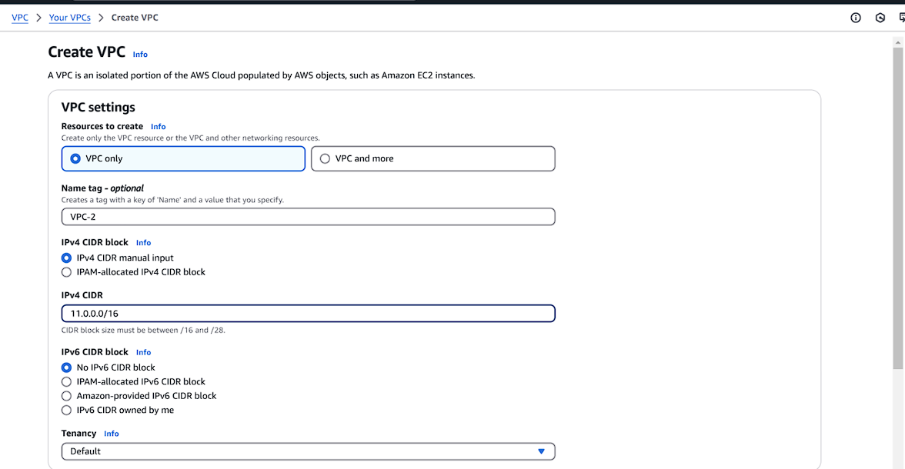
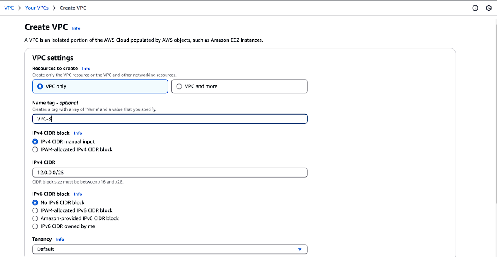
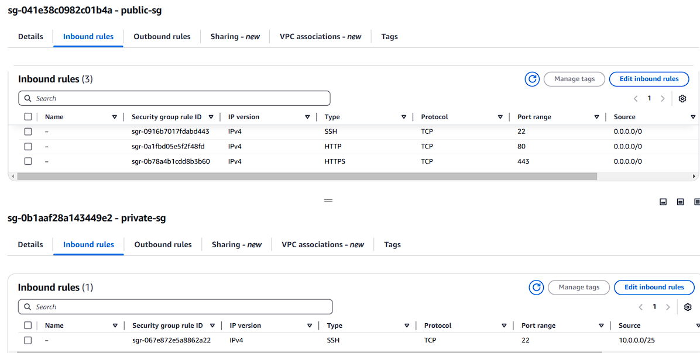
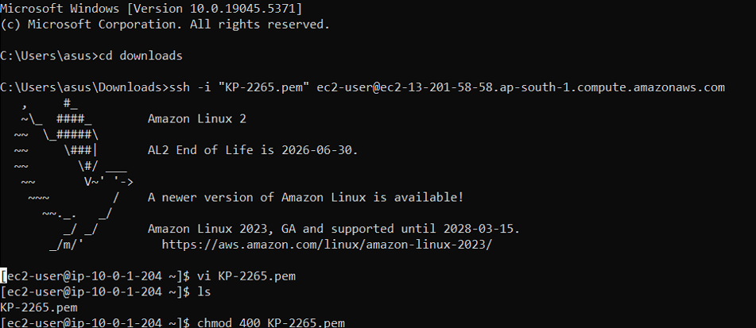

#  AWS VPC Transit Gateway

##  Procedure

---

###  Step 1: Create VPC-1 (Public VPC)

- Create a VPC with CIDR block: `10.0.0.0/25`
- Create a **public subnet**: `10.0.0.0/26`
- Create and attach an **Internet Gateway (IGW)** to VPC-1
- Configure the route table for the public subnet:
  - Add route: `0.0.0.0/0` → IGW
- Enable **DNS hostname resolution** in VPC settings


---

###  Step 2: Create VPC-2 (Private VPC)

- Create a VPC with CIDR block: `11.0.0.0/25`
- Create a **private subnet**: `11.0.0.0/26`
- Configure a **private route table** for VPC-2
- Enable **DNS hostname resolution** in VPC-2 settings




---

###  Step 3: Create VPC-3 (Private VPC)

- Create a VPC with CIDR block: `12.0.0.0/25`
- Create a **private subnet**: `12.0.0.0/26`
- Configure a **private route table** for VPC-3
- Enable **DNS hostname resolution** in VPC-3 settings




---

###  Step 4: Configure Security Groups

- **Public Security Group (VPC-1)**:
  - Allow inbound:
    - SSH (Port 22)
    - HTTP (Port 80)
    - HTTPS (Port 443)

- **Private Security Groups (VPC-2 & VPC-3)**:
  - Allow SSH access **only from VPC-1**
  
##  VPC Configuration

| VPC | CIDR Block    | Subnet Type | IGW | EC2 | TGW |
|-----|---------------|-------------|-----|-----|-----|
| VPC-1 | 10.0.0.0/25 | Public      | ✅  | ✅  | ✅  |
| VPC-2 | 11.0.0.0/25 | Private     | ❌  | ✅  | ✅  |
| VPC-3 | 12.0.0.0/25 | Private     | ❌  | ✅  | ✅  |




---

###  Step 5: Deploy EC2 Instances

- Launch an **Amazon Linux 2 EC2 instance** in VPC-1 (with a public IP)
- Use the following **User Data** script:

  ```bash
  #!/bin/bash
  yum update -y
  yum install httpd -y
  systemctl start httpd
  systemctl enable httpd
  echo "<h1>Welcome</h1>" > /var/www/html/index.html


###  Step 6: Verify Connectivity

- Connect to the **EC2 instance in VPC-1** using SSH.




- 	From there, connect to the private EC2 instances in **VPC-2 and VPC-3**
  


